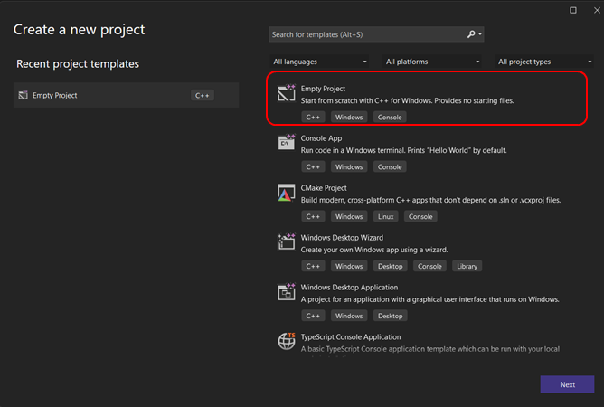
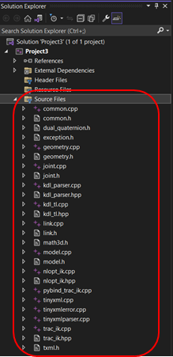
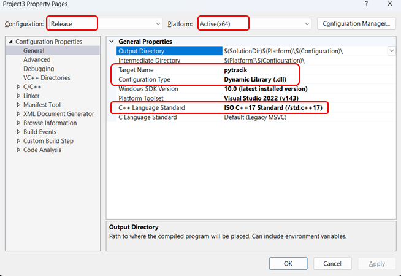
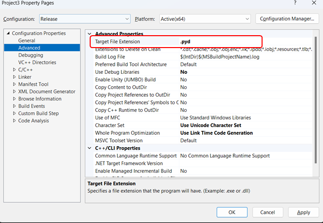
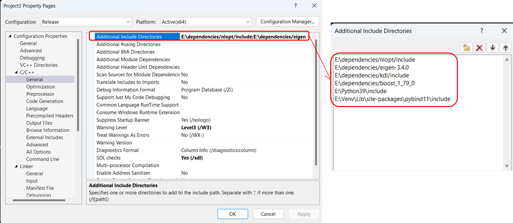
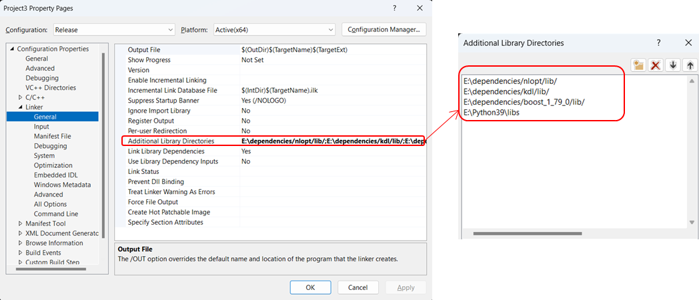
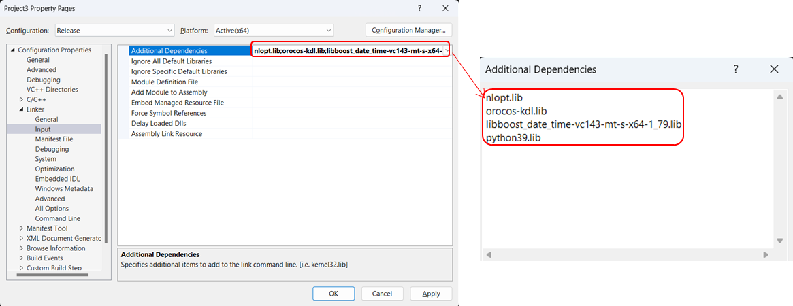

# pytracik - Trac-IK bindings in Python

Welcome to pytracik, a Python library that provides convenient and efficient bindings for the [Trac-IK](https://bitbucket.org/traclabs/trac_ik/src/master/) inverse kinematics solver. With support for Python 3.8+ and compatibility across both Windows and Linux environments.
pytracik eliminates the need for ROS installation and simplifies the integration process. 

**Differences from Original Repo**:

- **ROS-Free Integration**: Say goodbye to the ROS requirement. pytracik allows you to effortlessly incorporate Trac-IK's advanced inverse kinematics solver into your Python projects. However, it still depends on the
   `boost`,`eigen`,`orocos-kdl` and `nlopt` libraries. 
- **Cross-Platform Compatibility**: Whether you're on Windows or Linux, pytracik ensures consistent functionality across environments.

## Links
- Trac-IK Repository: https://bitbucket.org/traclabs/trac_ik/src/master/
- Trac-IK Homepage: https://traclabs.com/projects/trac-ik/
- Other ROS-free Trac-IK Python Bindings: https://github.com/mjd3/tracikpy

# Quick Start
```python
import os
import numpy as np
from pytracik.trac_ik import TracIK

urdf_path = os.path.join(os.path.dirname(__file__), "urdf/yumi.urdf")

yumi_rgt_arm_iksolver = TracIK(base_link_name="yumi_body",
                             tip_link_name="yumi_link_7_r",
                             urdf_path=urdf_path, )
yumi_lft_arm_iksolver = TracIK(base_link_name="yumi_body",
                             tip_link_name="yumi_link_7_l",
                             urdf_path=urdf_path, )
seed_jnt = np.array([-0.34906585, -1.57079633, -2.0943951, 0.52359878, 0.,
                   0.6981317, 0.])
tgt_pos = np.array([.3, -.4, .1])
tgt_rotmat = np.array([[0.5, 0., 0.8660254],
                     [0., 1., 0.],
                     [-0.8660254, 0., 0.5]])
result = yumi_rgt_arm_iksolver.solve(tgt_pos, tgt_rotmat, seed_jnt_values=seed_jnt)
print(result)
```
Output:
```python
[ 1.17331584 -1.99621953 -1.08811406 -0.18234367  0.66571608  1.26591
  0.18141696]
```

# Installation

## Installation on Linux
Here we use Ubuntu 22.04 as an example.

1. Install dependencies: 1. _Boost_ 2. _Eigen3_ 3. _Orocos_ KDL 4. _NLopt_
    ```Bash
    sudo apt install libboost-all-dev libeigen3-dev liborocos-kdl-dev libnlopt-dev 
    ```
TODO: Finishthe installation instructions

## Install on Windows
1. Download Visual Studio (https://visualstudio.microsoft.com/downloads/). Here we use Visual Studio 2022 as an example.
   Install required components:
   - Desktop development with C++
   - C++ CMake tools for Windows 
2. Install required Python packages:
   ```bash
   pip install -r requirements.txt
   ```
3. Download Dependencies:
   - Option 1: Quick Download from Google Drive ( **Recommended** )
     - For your convenience, you can download a pre-packaged zip file containing the required dependencies directly from our Google Drive: https://drive.google.com/file/d/1Smv3pJS6yL0Ss_gbsm0m6zD3mG-lQ47x/view?usp=sharing)
   
   - Option 2: Manual Download from Official Websites
     - Download _Boost_ 1.79.0 (https://www.boost.org/) 
     - _Eigen3_ 3.4.0 (https://eigen.tuxfamily.org/index.php?title=Main_Page)
     - _NLopt_ (https://nlopt.readthedocs.io/en/latest/)
     - _Orocos KDL_ (https://orocos.github.io/orocos_kinematics_dynamics/installation.html)
   
4. Compile pytracik with Visual Studio following the instructions below.
   a. Create an C++ `Empty project` in Visual Studio.

      

   b. Add the source files in `src` folder to the project.

      
   
   c.  Right click the project and select `Properties`. 
      - Set the `Configuration` to `Release` and `Platform` to `Active (x64)`
      - In the `Configuration Properites/General` tab, set the `Target Name` to `pytracik`.
      - Set the `Configuration Type` to `Dynamic Library (.dll)`.
      - Set C++ language standard to `ISO C++17 Standard (/std:c++17)`.

          
   
   d. In the `Configuration Properites/Advanced` tab, set `Taget File Extension` to `.pyd`.
      
   
   e. In the `C/C++` tab, add the include directories of 1. _Boost_, 2. _Eigen3_, 3. _NLopt_ and 4. _Orocos KDL_ 5. _Python_ and 6. _Pybind11_  to `Additional Include Directories`.

        
   
   f. In the `Linker/General` tab, add the library directories of 1. _Boost_, 2. _NLopt_ 3. _Orocos KDL_ and 4. _Python_ to `Additional Library Directories`.

      
   
    g. In the `Linker/Input` tab, add the library names of 1. _Boost_, 2. _NLopt_ 3. _Orocos KDL_ and 4. _Python_ to `Additional Dependencies`.

       
   
    h. Set the `Solution Configuration` to `Release` and `Solution Platform` to `x64`. Then build the project. The `pytracik.pyd` file will be generated in the `Release` folder.
      
5. Copy the `pytracik.pyd` file to the [pytracik](pytracik) folder.
   **Note**: if the error `ImportError: DLL load failed while importing pytracik: The specified module could not be found.` occurs, please copy the `nlopt.dll` in the `<NLopt installation path\bin>` to the [pytracik](pytracik) folder:


