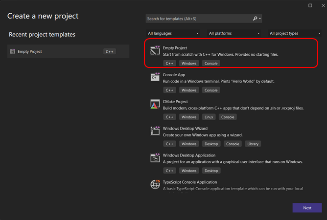
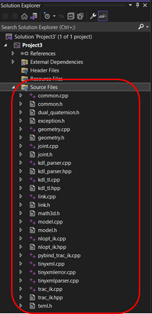
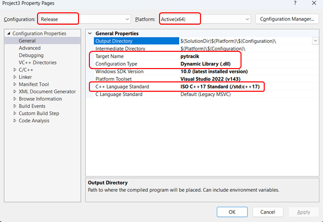
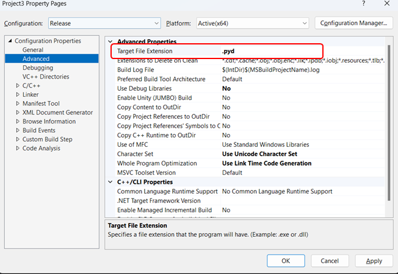
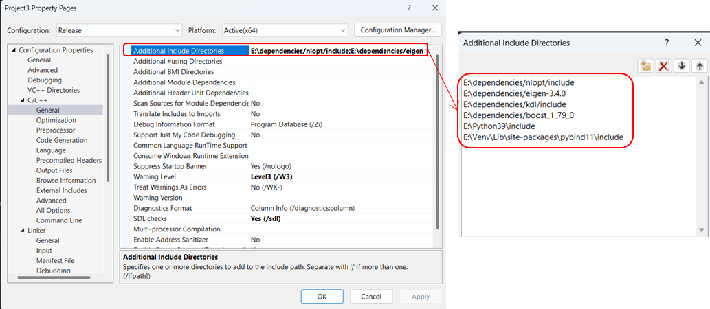
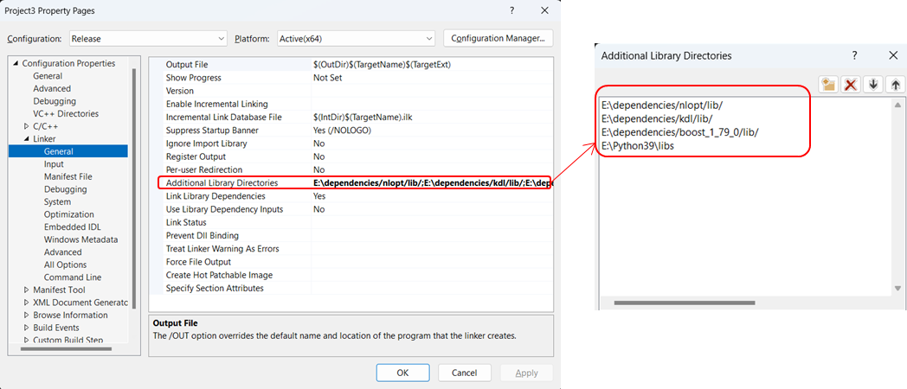
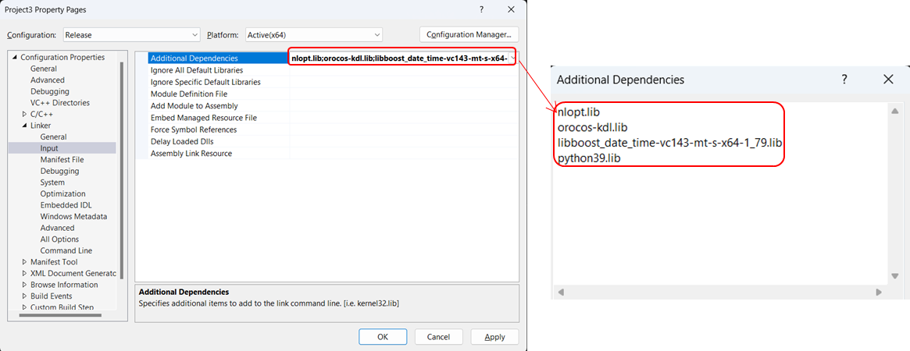
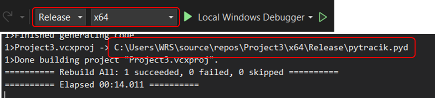

# pytracik - Trac-IK bindings in Python

[](https://opensource.org/licenses/MIT)

Welcome to pytracik, a Python library that provides convenient and efficient bindings for the [Trac-IK](https://bitbucket.org/traclabs/trac_ik/src/master/) inverse kinematics solver. With support for Python 3.8+ and compatibility across both Windows and Linux environments.
pytracik eliminates the need for ROS installation and simplifies the integration process. 

**✨ Differences from Original Repo**:

- **🚀 ROS-Free Integration**: Say goodbye to the ROS requirement. pytracik allows you to effortlessly incorporate Trac-IK's advanced inverse kinematics solver into your Python projects. However, it still depends on the
   `boost`,`eigen`,`orocos-kdl` and `nlopt` libraries. 
- **💻 Cross-Platform Compatibility**: Whether you're on Windows or Linux, pytracik ensures consistent functionality across environments.

## 🔗 Links
- Trac-IK Repository: https://bitbucket.org/traclabs/trac_ik/src/master/
- Trac-IK Homepage: https://traclabs.com/projects/trac-ik/
- Other ROS-free Trac-IK Python Bindings: https://github.com/mjd3/tracikpy

# ⚡ Quick Start
```python
import os
import numpy as np
from trac_ik import TracIK

urdf_path = os.path.join(os.path.dirname(__file__), "urdf/yumi.urdf")

yumi_rgt_arm_iksolver = TracIK(base_link_name="yumi_body",
                             tip_link_name="yumi_link_7_r",
                             urdf_path=urdf_path, )
yumi_lft_arm_iksolver = TracIK(base_link_name="yumi_body",
                             tip_link_name="yumi_link_7_l",
                             urdf_path=urdf_path, )
seed_jnt = np.array([-0.34906585, -1.57079633, -2.0943951, 0.52359878, 0.,
                   0.6981317, 0.])
tgt_pos = np.array([.3, -.4, .1])
tgt_rotmat = np.array([[0.5, 0., 0.8660254],
                     [0., 1., 0.],
                     [-0.8660254, 0., 0.5]])
result = yumi_rgt_arm_iksolver.ik(tgt_pos, tgt_rotmat, seed_jnt_values=seed_jnt)
print(result)
```
Output:
```python
[ 1.17331584 -1.99621953 -1.08811406 -0.18234367  0.66571608  1.26591
  0.18141696]
```

# 📦 Installation

## 🔧 System Prerequisites

pytracik is a C++ extension that compiles from source.  You **must** install the following system libraries before installing the Python package:

| Library | Purpose |
|---------|---------|
| **Boost** (date_time, system, thread) | General C++ utilities |
| **Eigen3** | Linear algebra |
| **Orocos KDL** | Kinematics & dynamics |
| **NLopt** | Numerical optimisation |

### 🐧 Linux (Ubuntu / Debian)

```bash
sudo apt-get update
sudo apt-get install -y libboost-all-dev libeigen3-dev liborocos-kdl-dev libnlopt-dev libnlopt-cxx-dev
```

### 🍎 macOS (Homebrew)

```bash
brew install boost eigen orocos-kdl nlopt
```

### 🪟 Windows

Download the dependencies from official sources or use the pre-packaged zip from the project releases:

- _Boost_ 1.79.0 — <https://www.boost.org/>
- _Eigen3_ 3.4.0 — <https://eigen.tuxfamily.org/>
- _NLopt_ — <https://nlopt.readthedocs.io/>
- _Orocos KDL_ — <https://orocos.github.io/orocos_kinematics_dynamics/installation.html>

**👉 Shortcut:** Grab the pre-packaged zip: 📥 <https://github.com/chenhaox/pytracik/releases/tag/dependency_files>

Unzip it into the project root so that a `dependency/` folder exists next to `setup.py`.

## ⚡ Install from PyPI (recommended)

Once the system prerequisites above are installed:

```bash
pip install pytracik
```

## ⚡ Install from GitHub

```bash
# pip
pip install "pytracik @ git+https://github.com/chenhaox/pytracik.git"

# uv
uv add "pytracik @ git+https://github.com/chenhaox/pytracik.git"
```

## 🛠️ Install from source

```bash
git clone https://github.com/chenhaox/pytracik.git
cd pytracik
pip install .
```


## 🪟 Windows: Manual Build with Visual Studio (advanced)

1. Download Visual Studio (https://visualstudio.microsoft.com/downloads/). Here we use Visual Studio 2022 as an example.
   Install required components:
   - Desktop development with C++
   - C++ CMake tools for Windows  

2. Compile pytracik with Visual Studio following the instructions below.
   a. Create an C++ `Empty project` in Visual Studio.

      

   b. Add the source files in `src` folder to the project.

      
   
   c.  Right click the project and select `Properties`. 
      - Set the `Configuration` to `Release` and `Platform` to `Active (x64)`
      - In the `Configuration Properites/General` tab, set the `Target Name` to `pytracik_bindings`.
      - Set the `Configuration Type` to `Dynamic Library (.dll)`.
      - Set C++ language standard to `ISO C++17 Standard (/std:c++17)`.

          
   
   d. In the `Configuration Properites/Advanced` tab, set `Taget File Extension` to `.pyd`.
      
   
   e. In the `C/C++` tab, add the include directories of 1. _Boost_, 2. _Eigen3_, 3. _NLopt_ and 4. _Orocos KDL_ 5. _Python_ and 6. _Pybind11_  to `Additional Include Directories`.

        
   
   f. In the `Linker/General` tab, add the library directories of 1. _Boost_, 2. _NLopt_ 3. _Orocos KDL_ and 4. _Python_ to `Additional Library Directories`.

      
   
    g. In the `Linker/Input` tab, add the library names of 1. _Boost_, 2. _NLopt_ 3. _Orocos KDL_ and 4. _Python_ to `Additional Dependencies`.

       
   
    h. Set the `Solution Configuration` to `Release` and `Solution Platform` to `x64`. Then build the project. The `pytracik_bindings.pyd` file will be generated in the `Release` folder.
      
3. Copy the `pytracik_bindings.pyd` file to the [pytracik](pytracik) folder.
   **Note**: if the error `ImportError: DLL load failed while importing pytracik: The specified module could not be found.` occurs, please copy the `nlopt.dll` in the `<NLopt installation path\bin>` to the [pytracik](pytracik) folder:
4. Make installation (**Optional**):
   ```bash
   pip install -e .
   ```